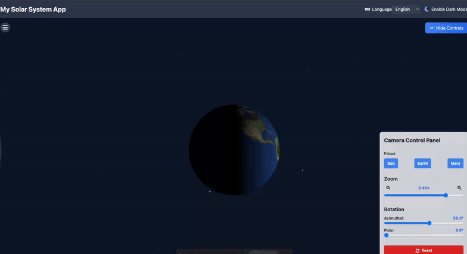

# Solar System 3D Visualization

A 3D Solar System simulation with dynamic control over the Sun, Halo, and Camera using **React Three Fiber** and **Three.js**. The project includes dynamic controls for visual effects, responsive UI elements, and a reusable canvas component for rendering 3D elements.

---

## Project Progress

Here, we showcase the periodic progress of the project in stages, including GIFs, screenshots, or notes.

### Stage 1: Sun

### Stage 2: Starfield Effect

### 🌍 Stage 3: Earth

#### Version 1: Basic Earth Rendering

#### Version 2: Improved day-night transition for smoother blending.

---

## Features

### 🌞 Sun Configuration
- **Polar Speed Factor**: Controls the differential rotation speed.
- **Granulation Intensity**: Adjusts the texture's fine surface details.
- **Surface Intensity**: Scales the brightness of the Sun's texture.
- **Plasma Flow Speed**: Modifies the speed of plasma motion.
- **Corona Glow Strength**: Controls the brightness and size of the Sun's corona.
- **Flare Intensity**: Adjusts the strength of solar flares.
- **Radiant Ray Strength**: Configures the Sun's radiant rays effect.
- **Alpha Transparency**: Dynamically controls the Sun's overall transparency.

### 🌌 Starfield Configuration
- **Star Density**: Adjusts the number of stars visible in the scene.
- **Star Colors**: Includes red, blue, and yellow stars for variety.
- **Motion Effect**: Yellow stars move dynamically to create depth.
- **Flickering Effect**: Red and blue stars have a subtle flickering effect using custom shaders.
- **Random Distribution**: Stars are distributed randomly using Perlin noise for natural clustering.
